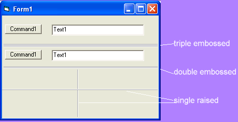



## Line 3D    replacement for the line control

### Description

a replacement for the standard line control. creates a line that looks more like the line that makes up the edge of the frame control (screenshot) there are 3 types, (single,double, triple) and 2 different types (embossed, raised). Not a huge or fancy control but will save you about 4 or 5 lines of code, without having to think too hard.  with there control there is no coding whatsoever..like the standard line control..just drop and position and your done
 
### More Info
 

             |
---                |---
**Submitted On**   |2005-02-06 21:26:32
**By**             |[Evan Toder](https://github.com/Planet-Source-Code/PSCIndex/blob/master/ByAuthor/evan-toder.md)
**Level**          |Intermediate
**User Rating**    |5.0 (10 globes from 2 users)
**Compatibility**  |VB 3\.0, VB 4\.0 \(16\-bit\), VB 4\.0 \(32\-bit\), VB 5\.0, VB 6\.0
**Category**       |[Custom Controls/ Forms/  Menus](https://github.com/Planet-Source-Code/PSCIndex/blob/master/ByCategory/custom-controls-forms-menus__1-4.md)
**World**          |[Visual Basic](https://github.com/Planet-Source-Code/PSCIndex/blob/master/ByWorld/visual-basic.md)
**Archive File**   |[Line\_3D\_\_\_184936262005\.zip](https://github.com/Planet-Source-Code/evan-toder-line-3d-replacement-for-the-line-control__1-58746/archive/master.zip)

